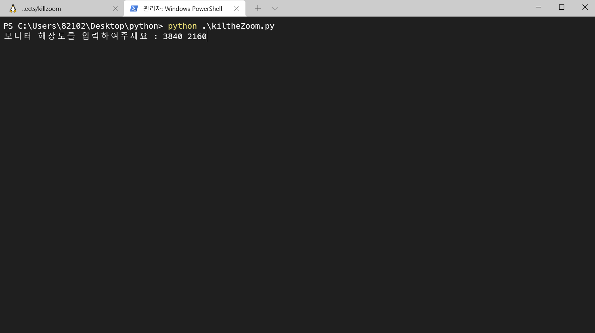
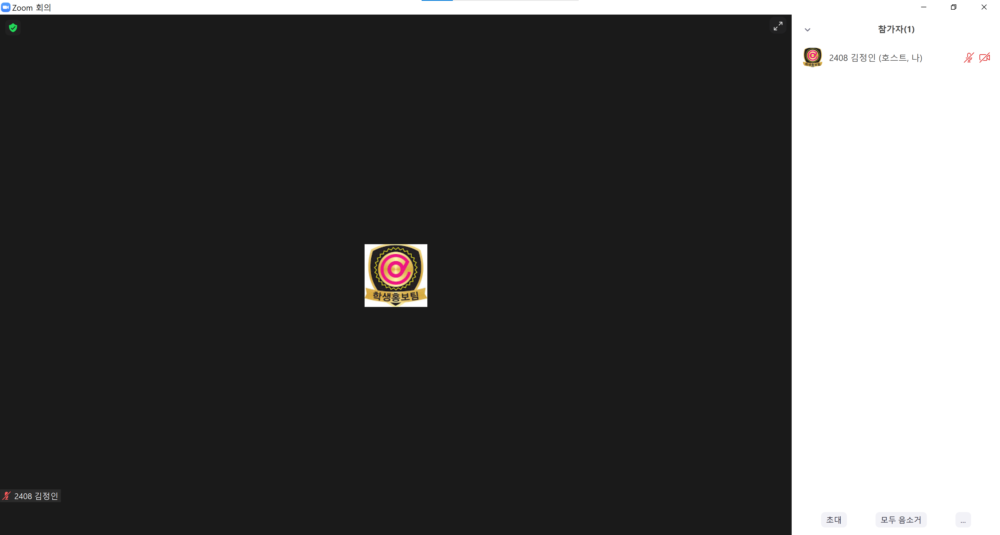

# How To Use killtheZoom-2.0

## Windows
**0. https://joyhong.tistory.com/79 이 글을 보면서 tesseract를 C:\Program Files\Tesseract-OCR 경로로 설치해주세요(한국어 언어 추가 필요)**
1. 상단의 초록색 'Code' 버튼 클릭 후 'Dowoload ZIP' 클릭 후 소스코드 다운로드
2. powershell 실행 후 해당 소스코드의 폴더 directory로 이동(cd "소스코드 폴더 위치")
3. `pip install -r requirements.txt`
4. `python killtheZoom.py`
5. 이후 터미널의 cli를 지시사항 이행
   
   
## MacOS (13-Inch)
homebrew, python3, pip3 설치 완료 후,
**0. 터미널을 열고 `brew install tesseract` 완료 후 `brew install tesseract-lang` 입력**
1. 다음 링크를 따라 해상도를 '추가 공간' 으로 설정 https://apple.co/3iJC18p
2. 상단의 초록색 'Code' 버튼 클릭 후 'Dowoload ZIP' 클릭 후 소스코드 다운로드
3. 해당 소스코드의 폴더 directory로 이동(cd "소스코드 폴더 위치")
4. `pip3 install -r requirements.txt`
5. `python3 killtheZoom_for_Mac.py`
~~13인치 이외의 맥 사용시 해상도에 따라 killtheZoom_forMac.py의 12~15번째 줄을 하드코딩~~
~~해상도 값 구하는 공식을 알고 계시다면 PR열어주세요 ㅜㅜ~~

## Zoom setting

Windows
1. Zoom 화면공유 -> 화면 공유 시 창 크기 : 현재 크기 유지
2. Zoom 화면 최대화
3. Zoom 참가자 버튼 클릭

MacOS
1. '전체 화면 시작'이 아닌 줌 상단바 더블클릭의 전체화면
2. Zoom 참가자 버튼 클릭

**화면 예시**

   

> 주의 1 : 화면을 인식하여 끄는 것이기에 줌 화면을 가리면 제대로 작동하지 않음  
> 주의 2 : 듀얼모니터를 사용 중이라면 메인 모니터에 줌 화면이 켜져있어야 함
